## 專案概述 - [展示影片](https://www.youtube.com/shorts/vTQ440cKvO0)
這個專案是一個基於臺灣證券交易所服務 API 所開發的 Demo 應用程式，旨在展示現代 Android 開發的最佳實踐與技術整合。
透過此應用，您可以獲取股市前一日的數據的呈現與互動操作。

## 技術與架構
本 Demo 應用程式採用了以下領先技術與設計模式，確保了程式碼的品質、可維護性與高效能：

#Kotlin、#JetpackComposeUI、#MVI、#Coroutines、#ViewModel、#OkHttp、#Retrofit、#Hilt、#JUnit4、#Mockito

- **開發語言：Kotlin**
  - 現代且功能豐富的 Android 首選語言。
- **使用者介面 (UI)：Jetpack Compose**
  - 採用宣告式 UI 範式，大幅簡化 UI 開發流程，提供流暢的使用者體驗。
- **架構模式：MVI (Model-View-Intent)**
  - 通過單向數據流和明確的職責分離，有效提升業務邏輯與 UI 分離度，增加程式碼的可測試性與可擴展性。
- **網路通訊：OkHttp / Retrofit**
  - 強大且高效的 HTTP Client 與型別安全的 RESTful API 客戶端，用於與臺灣證券交易所 API 進行數據互動。
- **依賴注入：Hilt**
  - 基於 Dagger 的 Android 依賴注入解決方案，簡化了依賴的管理與提供。
- **單元測試：JUnit4 / Mockito**
  - 嚴謹的測試框架，確保核心業務邏輯的正確性與穩定性。

## 專案特色
- **響應式設計**：
  - 支援螢幕轉向，確保在不同方向下都能提供最佳顯示效果。
- **多模式支援**：
  - 提供夜晚模式（Dark Mode），提升使用者在不同光線環境下的觀看舒適度。
  - 提供動態色彩（Material You），提升使用者更深入的自訂化體驗。
- **模組化開發**：
  - 採用清晰的 MVI 架構，便於功能擴展與團隊協作。
- **穩健的測試**：
  - 透過完善的單元測試，保障應用程式的穩定性與可靠性。

## 程式截圖

### 主程式畫面
<table>
  <tr>
    <td>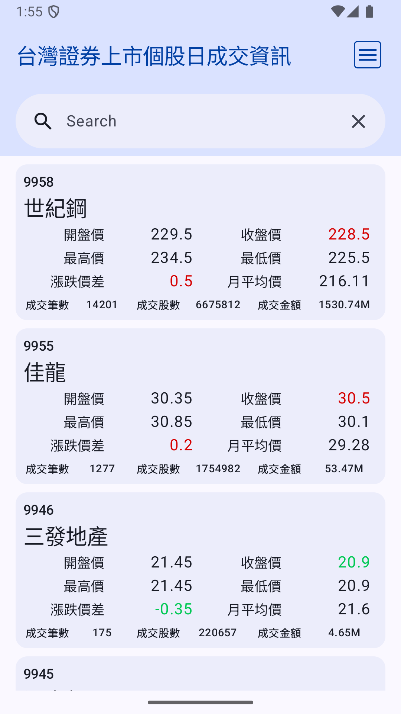</td>
    <td>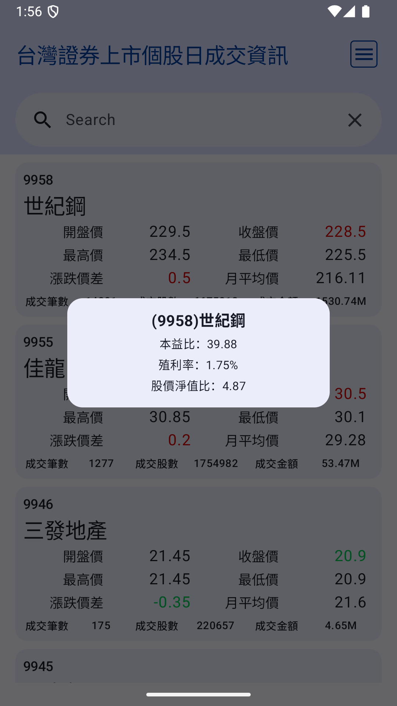</td>
    <td>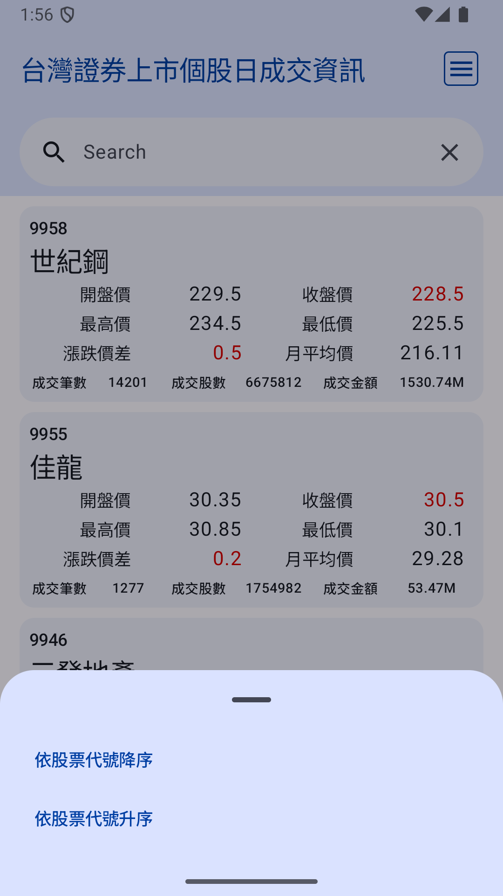</td>
    <td>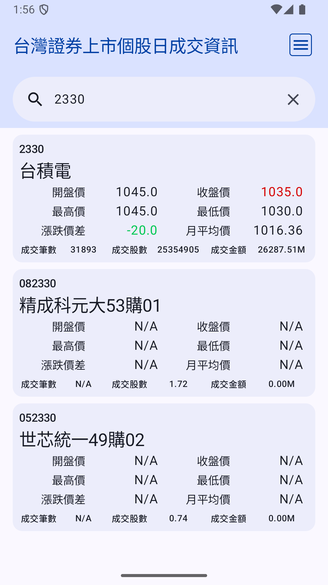</td>
  </tr>
  <tr>
    <td align="center">主畫面</td>
    <td align="center">彈窗畫面</td>
    <td align="center">排序功能畫面</td>
    <td align="center">搜尋畫面</td>
  </tr>
</table>

### 支持 夜間模式
<table>
  <tr>
    <td>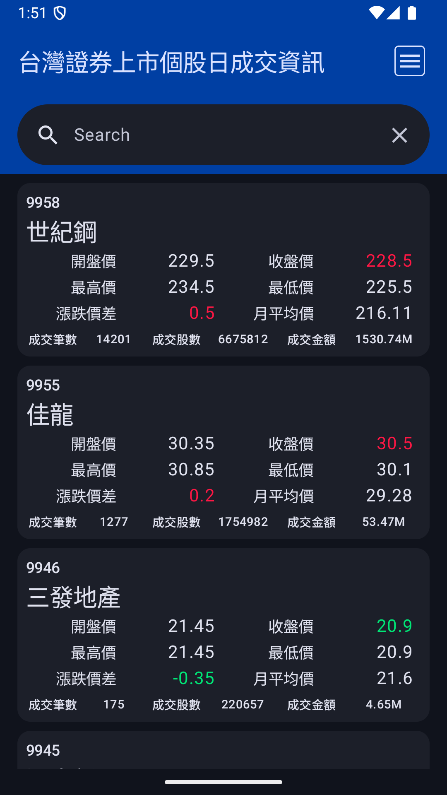</td>
    <td>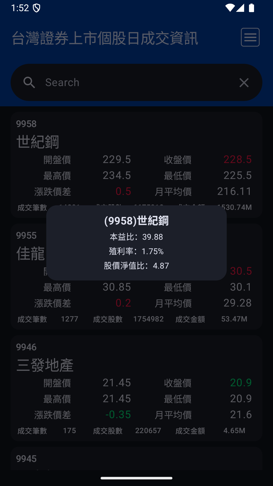</td>
    <td>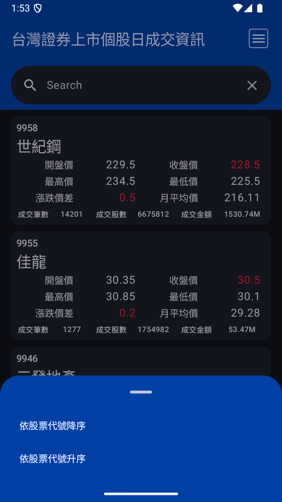</td>
    <td>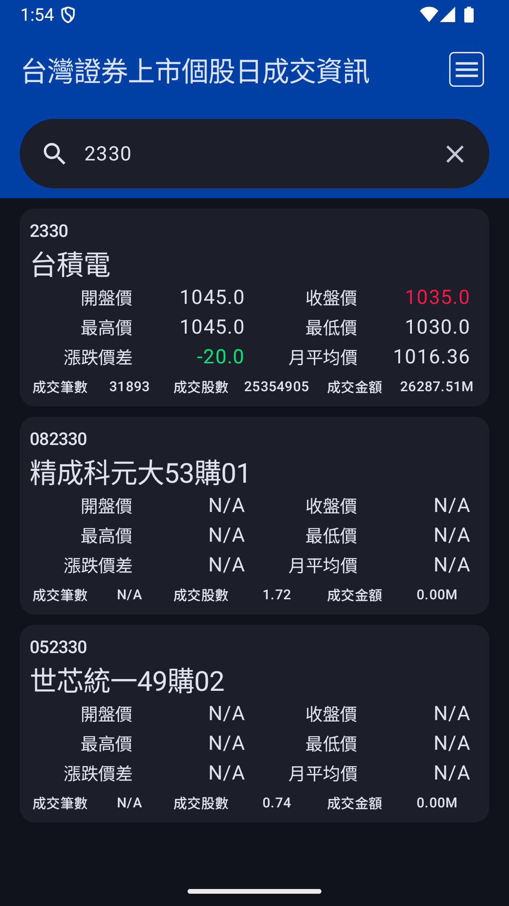</td>
  </tr>
  <tr>
    <td align="center">主畫面</td>
    <td align="center">彈窗畫面</td>
    <td align="center">排序功能畫面</td>
    <td align="center">搜尋畫面</td>
  </tr>
</table>

### 支持 動態色彩(Material You)
<table>
  <tr>
    <td>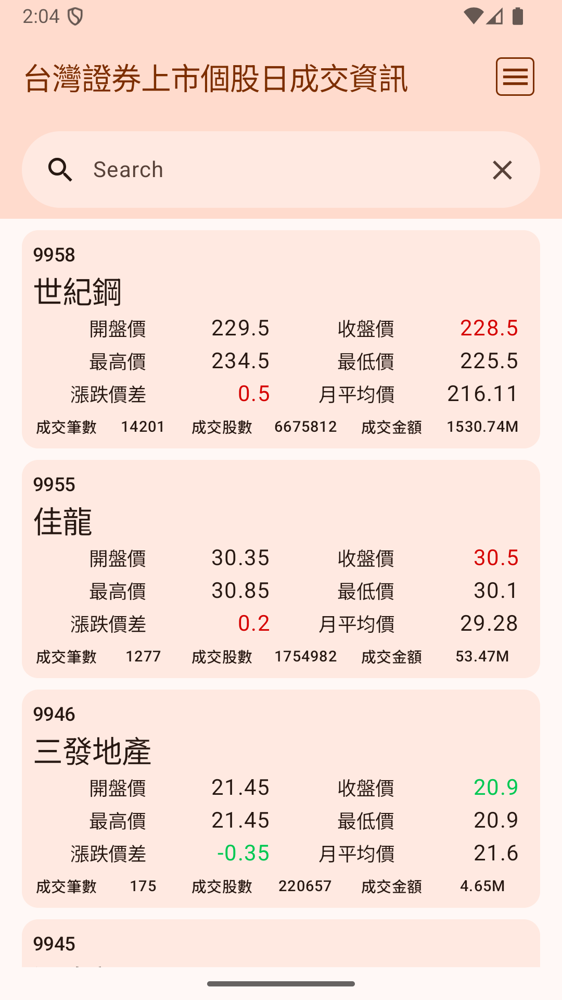</td>
    <td>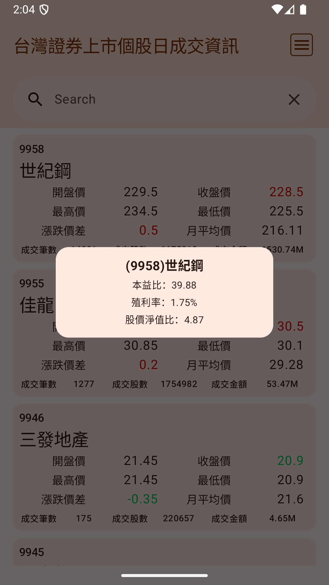</td>
    <td>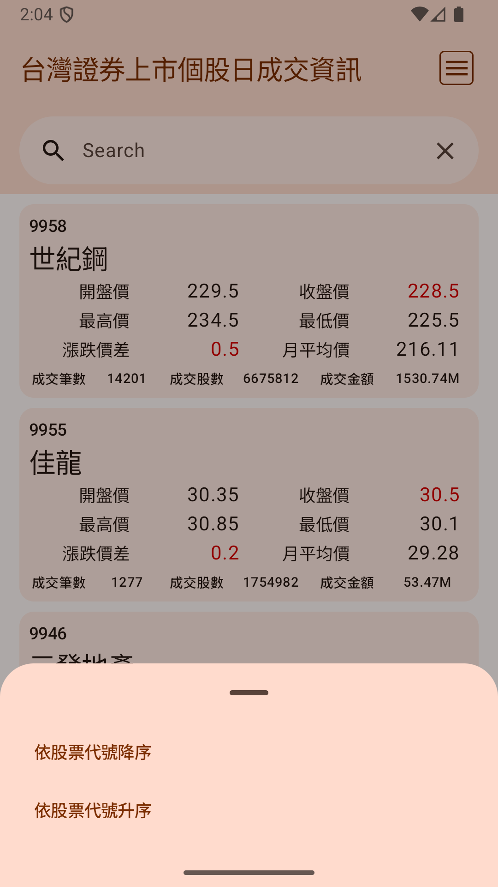</td>
    <td>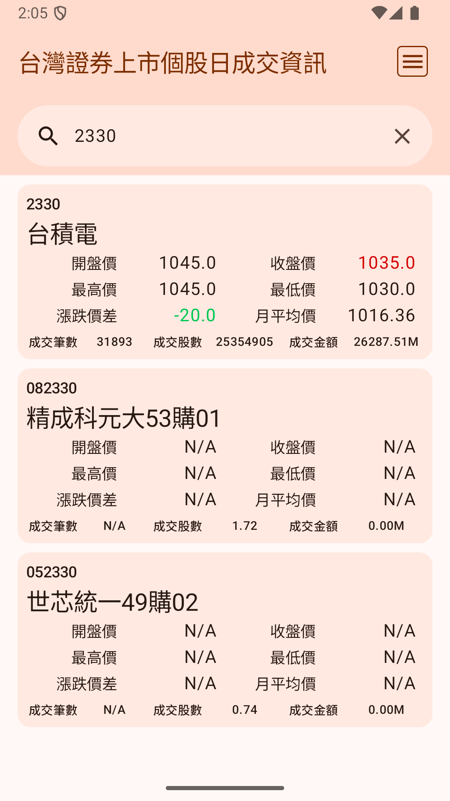</td>
  </tr>
  <tr>
    <td align="center">主畫面</td>
    <td align="center">彈窗畫面</td>
    <td align="center">排序功能畫面</td>
    <td align="center">搜尋畫面</td>
  </tr>
</table>
